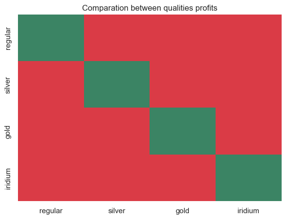
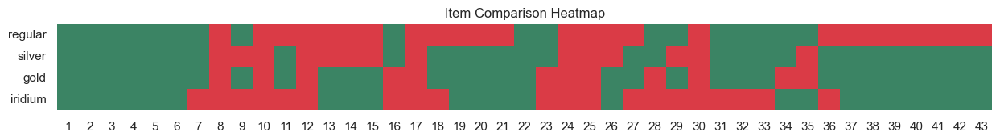
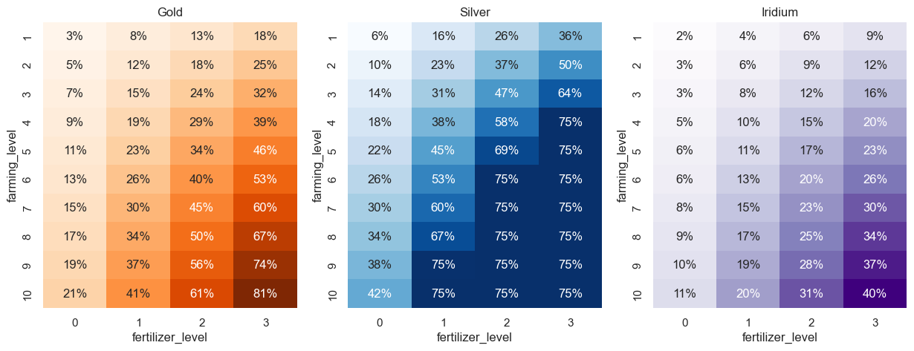
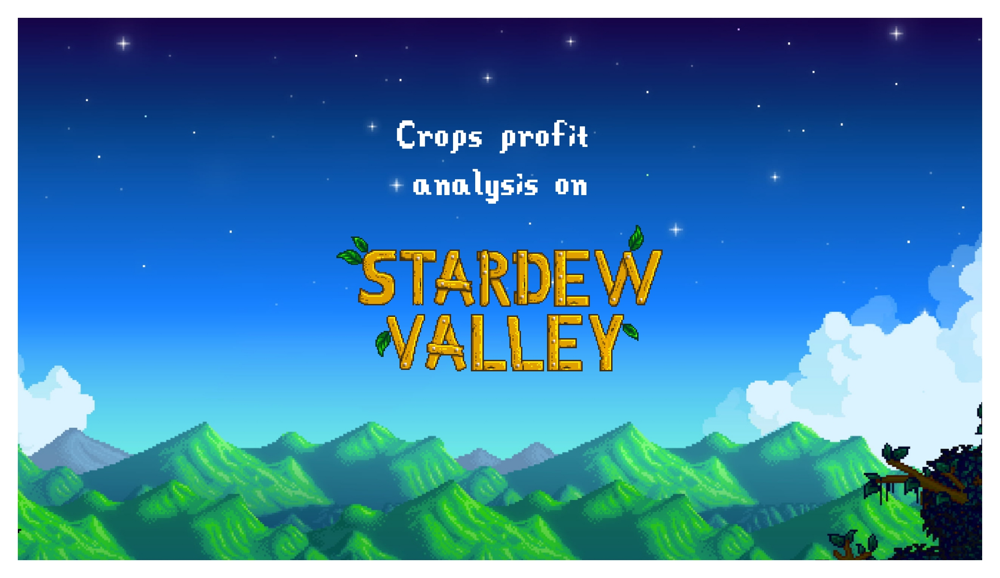
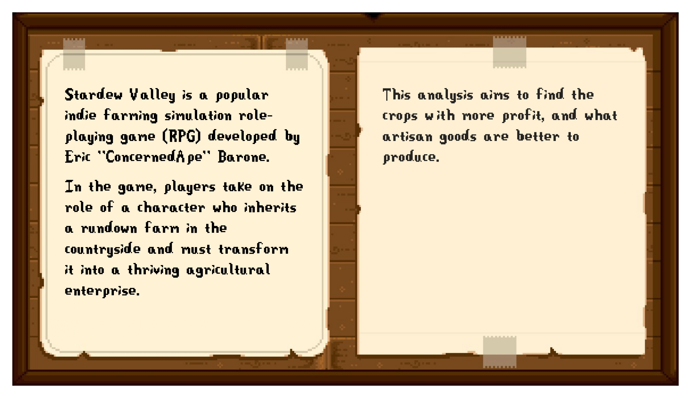
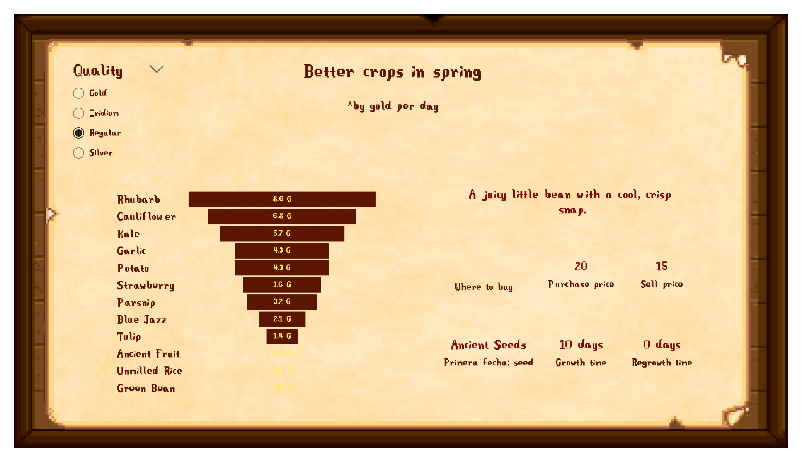
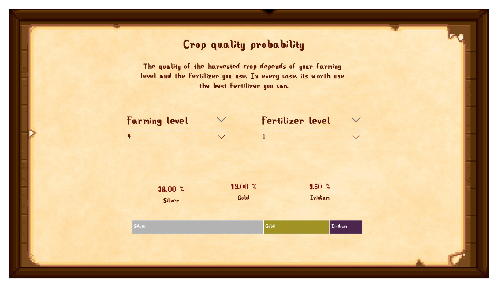

# DS-Stardew-Valley-Crops-Profit

Stardew Valley is a popular indie farming simulation role-playing game (RPG) developed by Eric "ConcernedApe" Barone.

In the game, players take on the role of a character who inherits a rundown farm in the countryside and must transform it into a thriving agricultural enterprise.

This analysis aims to find the crops with more profit, and what artisan goods are better to produce.

## Data extraction

To get the crops dataset, I used web scraper techniques to extract information from the [Stardew Valley Wiki](https://stardewvalleywiki.com/Stardew_Valley_Wiki). You can find the notebook of web scraper [here](notebooks/Stardew_valley_web_scraper.ipynb).

The information I got about each crop is:
* Name
* Description
* Growth time
* Regrowth time
* Source
* Sell price (in every quality)
* Seed
* Purchase price
  * General store
  * Night market
  * Egg festival
  * Traveling cart
  * Oasis
  * JojaMart
* Experience
* Energy
* Season
  
You can find all the raw data in csv format [here](data/crops_raw_data.csv).

## Data analysis

This analysis have various goals:

* Find the profit of each crop.
* Find what crops have the major profit for each season.
* Check how much each fertilizer is worth using.

To that, in a [notebook](notebooks/Stardew_valley_transform_data.ipynb) I transformed the dataset to can work with it. You can find also the transformed data [here](data/crops_preprocessed_data.csv).

After, I started to analyze the data. To see all I did you can read the notebook [analysis data](notebooks/Stardew_valley_analysis_data.ipynb). 

### Gold per day

First, I created a new measurement that help me to find the profit of each crop, the **gold per day**. I made it because there are some crops that regrowth after you harvest them without replanting and others do not. To compare both types, I calculated how many products you can get per season (28 days) and how much money you get if you sell in every quality. 

The formula will be:
$$Gold\ per\ day _{quality} = \frac{{Production\ per\ season} * {Sell\ price _{quality} - Cheapest\ purchase\ price}}{Season\ days}$$

Where

$Production\ per\ season$ = How many products do you get per season if you plant on the first day of the season. Without speed fertilizer.

$Sell\ price_{quality}$ = The sell price of each quality (regular, silver, gold and iridium).

$Cheapest\ purchase\ price$ = The cheapest price for which you can buy the seed.

$Season\ days = 28$

I got one measurement **gold per day** for each quality too. 

You can explore the results of calculate gold per day in this [csv file](data/crops_gold_per_day.csv).

### Profit for each quality

Analyzing the data, I noticed that if I order the crops by gold per day, the order for each quality is different.

In this map, you can see if we compare the order of one quality with other, all are differents.

If we compare each item of the order, we got the next map:

Where you can see that the first six items are always in the same order, but the rest change in every quality.

For that reason, we can't determinate only one crop as better, it depends about the quality probabilities do you have.

### Quality probabilities

I analyzed the probabilities with the quality formula. I found it also in the Stardew Valley Wiki.

The formulas used in the game's code are as follows: 

* **Gold**: $0.2 * (\frac{farming\ level}{10}) + 0.2 * (fertilizer\ level) * (\frac{farming\ level+2}{ 12}) + 0.01$
* **Silver**: 2 * chance for gold quality (capped at 75%) 
* **Iridium**: chance for gold quality / 2

Additionally, if the fertilizer is deluxe or better, then silver is the guaranteed minimum quality, and iridium is made possible. Recreating the formula in Python, I got a heatmap to display the probabilities depend the farming level you have and the fertilizer you use on the crop.

With that, you can choose one crop to plant depending your levels. 

### Reporting

I made the report of this project on Microsoft Power BI. The best way to display the report is download Power BI Desktop and open the [report](dashboards/Stardew-Valley-Crops-Profit.pbix). You can see a [pdf version](dashboards/Stardew-Valley-Crops-Profit.pdf), but for find results, you need to interact with the report.

Anyway, there is a fast previsualization of the report:

